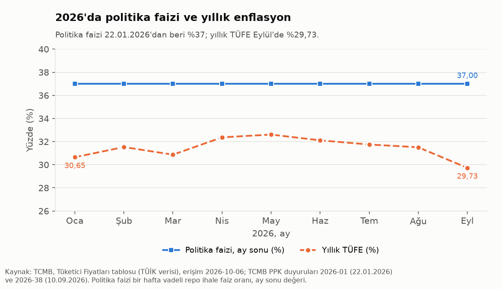
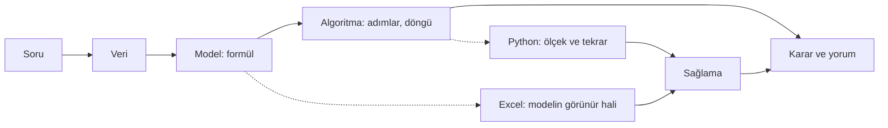
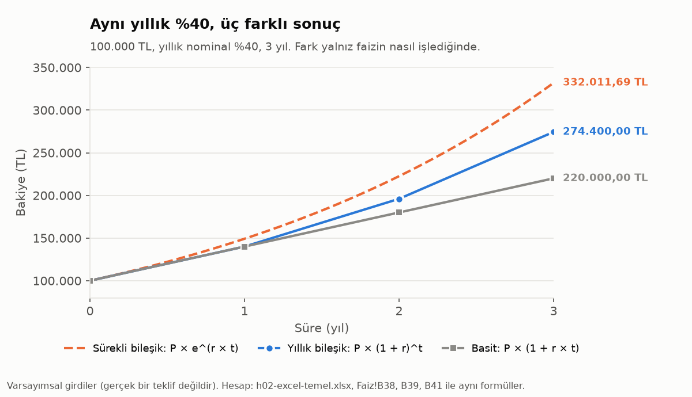
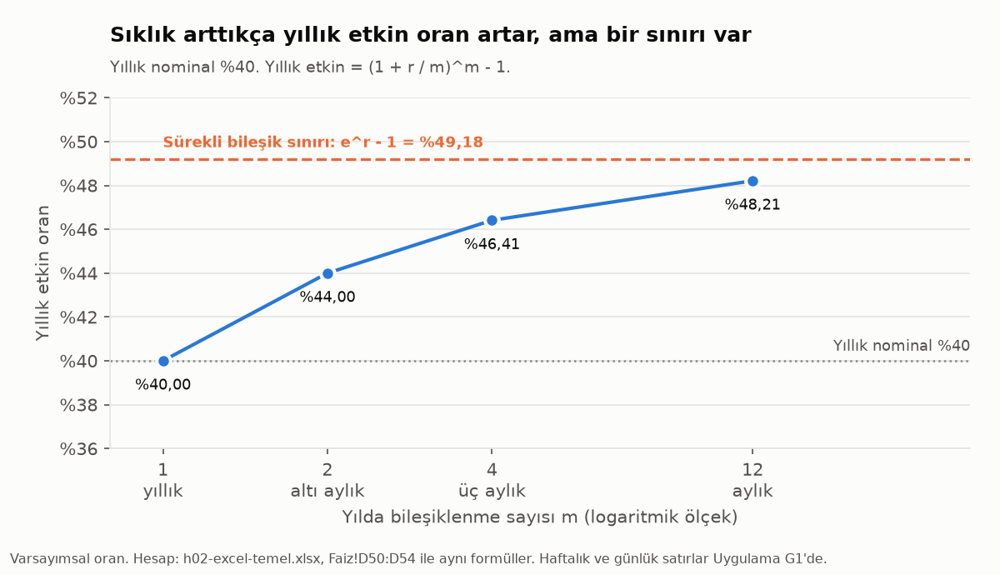

# H2 Finansal programlamaya giriş, faiz türleri ve teknik hesaplar (ders notu)

Formüller Türkçe Excel yazımıyla verilir: Türkçe fonksiyon adı, argümanlar arasında noktalı virgül (`;`), ondalık ayırıcı virgül. İngilizce Excel için yanındaki İngilizce yazım kullanılır: İngilizce ad, virgül (`,`), ondalık nokta. Dosya iki dilde de aynı çalışır.

Metinde yüzdeler Türkçe yazımla verilir (%40). Excel hücresinde aynı oran yüzde biçimiyle görünür. Ondalık işareti bilgisayarın bölge ayarından gelir. Hücrenin değeri her durumda 0,40'tır.

Bu not `h02-excel-temel.xlsx` dosyasının Faiz ve Uygulama sayfalarıyla, `h02-excel-temel.ipynb` defterinin "Faiz türleri ve teknik hesaplar" ve "Uygulama G3-G4" bölümleriyle birlikte okunur. Nottaki hücre adresleri dosyadakiyle aynıdır. Excel'in temel işlemleri (hücre, formül, başvuru, TOPLA, YUVARLA) ayrı bir notta anlatılır: [H2 Excel temel ders notu](h02-excel-temel-ders-notu.md).

**Çalışma sırası:** el kitabının f02 bölümü, bu ders notu, dosyanın Faiz sayfası, Uygulama sayfası (G1, G2), defterin Faiz bölümü ve G3-G4, sonra Excel temel notu ve Hesap, Alistirma, Ileri, Ev sayfaları.

## İçindekiler

0. Öğrenme hedefleri
1. Haftanın vakası ve geçen haftadan bağ
2. Finans temeli ve okuryazarlık ısınması
3. Bu haftanın sayıları
4. Finansal programlamanın tanımı
5. Faiz kavramı
6. Basit, bileşik ve sürekli bileşik faiz
7. Nominal ve etkin faiz
8. Reel faiz
9. Piyasadaki faizler ve faiz terimleri
10. GD, BD, ikiye katlanma ve eşit taksitli kredi
11. Excel'deki Faiz sayfası
12. Vakanın çözümü
13. Colab aynası ve Python temelleri
14. Hızlı şerit (notsuz)
15. Uygulama görevleri G1-G4
16. Sık hatalar ve hata mesajları
17. Alıştırma soruları
18. Özet ve sonraki hafta
19. Sözlük
20. Kaynaklar ve veri notu
21. Alıştırma sorularının cevapları

---

## 0. Öğrenme hedefleri

Bu hedefler izlencedeki H2 hedeflerini (Excel temel notu) tamamlar.

1. Finansal bir soruyu veri, model, algoritma ve karar adımlarına ayırmak; Excel'in ve Python'un bu zincirdeki rolünü açıklamak.
2. Basit, bileşik ve sürekli bileşik faizle gelecekteki değeri Excel'de ve Python'da hesaplamak.
3. Yıllık nominal oranı yıllık etkin orana çevirmek; ETKİN ve NOMİNAL fonksiyonlarını kullanmak; farklı sıklıkla işleyen teklifleri tek ölçüyle karşılaştırmak.
4. Fisher eşitliğiyle reel faizi hesaplamak ve kısa yolun yüksek oranlarda neden yanılttığını göstermek.
5. Bugünkü değeri, ikiye katlanma süresini ve 72 kuralını hesaplamak; sonucu ikinci bir yoldan sağlamak.
6. Basit fonksiyon ve döngüyle (Python) bir faiz tablosu üretmek.
7. Eşit taksitli kredinin taksitini ve amortisman tablosunu kurmak; tahsis ücretinin yıllık maliyete etkisini hesaplamak.
8. (Finans temeli) Politika faizi, mevduat faizi, akdi faiz, EYFO, yüzde puan ve baz puanı ayırt etmek.

---

## 1. Haftanın vakası ve geçen haftadan bağ

| | |
|---|---|
| Soru | **Aynı %40, üç farklı sonuç: faiz türü neden önemli?** |
| Neden şimdi? | TCMB Para Politikası Kurulu 10.09.2026'da politika faizini %37'de sabit tutmuştur (https://www.tcmb.gov.tr/wps/wcm/connect/tr/tcmb+tr/main+menu/duyurular/basin/2026/duy2026-38). TÜİK 05.10.2026'da Eylül 2026 yıllık TÜFE'sini %29,73 olarak açıklamıştır (TCMB Tüketici Fiyatları tablosu, erişim 06.10.2026). Haberlerde genellikle tek bir oran yer alır. Oranın türü yazılmadıkça ne kazandırdığı belli olmaz. |
| Veri ve dağıtım | Elle girilen sayılar, her biri kaynaklı (3. bölüm). Veri dosyası yok. Faiz örneklerindeki oranlar varsayımsaldır. |
| Excel'de | Faiz sayfası (yedi bölüm) ve Uygulama sayfası (G1, G2): ETKİN, NOMİNAL, GD, BD, ÜS, LN, TAKSİT_SAYISI |
| Colab'da | Defterin "Faiz türleri ve teknik hesaplar" bölümü (ayna) ve G3-G4: fonksiyon, döngü, grafik |
| Hızlı şerit | EVDS'den TÜFE endeksinin çekilmesi ve yıllık enflasyonun bu endeksten hesaplanması (14. bölüm) |
| El kitabı | [f02: Yüzde, oran ve faiz](../../finans-temeli/f02-yuzde-ve-faiz.md) |

**Vaka hikayesi.** Elde 100.000 TL bulunmaktadır ve bir ilanda "yıllık %40" yazmaktadır. Üç yıl sonundaki tutar, faizin nasıl işlediğine bağlıdır. Faiz yalnız anaparaya işlerse (basit) tutar 220.000 TL olur. Faiz her yıl anaparaya eklenirse (yıllık bileşik) tutar 274.400 TL olur. Faizin her an eklendiği varsayılırsa (sürekli bileşik) tutar 332.011,69 TL olur. Oran aynıdır, fark ise 112.011,69 TL'dir. Bu haftanın konusu, bu farkın hesaplanıp açıklanması ve farklı türden oranların tek bir ölçüye çevrilmesidir.

**Vaka için gereken bilgiler.**
- Faizin ne olduğu ve dönemi (5. bölüm)
- Basit, bileşik ve sürekli bileşik faiz (6. bölüm)
- Yıllık nominal ve yıllık etkin oran (7. bölüm)
- Reel faiz: enflasyondan arındırma (8. bölüm)
- Piyasadaki faizlerin adları (9. bölüm ve el kitabı f02)
- Gelecekteki ve bugünkü değer, ikiye katlanma süresi (10. bölüm)
- Aynı hesabın Excel'de ve Python'da kurulması (11. ve 13. bölüm)

Ders üç bloktan oluşur: önce giriş ve okuryazarlık ısınması, sonra faiz türleri ve teknik hesaplar (Excel ve Python, canlı), en sonda 50 dakikalık uygulama (G1-G4). Notun bölüm sırası da bu akışı izler.

Aşağıdaki şema haftanın hattını gösterir.


**Geçen haftadan bağ.** Excel temel notunda `=B1*(1+B2)^B3` formülüyle 10.000 TL'nin yıllık %40 bileşik faizle 3 yılda 27.440 TL olduğu bulunmuştur. Bu hafta aynı formül genelleştirilir. Faizin yılda bir yerine m kez eklendiği durum ve enflasyonun hesaba katıldığı durum ayrı ayrı incelenir.

> [!IMPORTANT]
> **Haftanın kuralı.** Bir faiz oranı iki bilgiyle birlikte okunur: oranın hangi döneme ait olduğu ve nasıl işlediği (basit, bileşik ya da yılda kaç kez bileşik).

---

## 2. Finans temeli ve okuryazarlık ısınması

Dersin ilk 12 dakikası bu bölüme ayrılır. Kavramların tam anlatımı el kitabında yer alır: [El kitabı f02: Yüzde, oran ve faiz](../../finans-temeli/f02-yuzde-ve-faiz.md). Bu bölümde üç ısınma sorusu ve kısa bir özet bulunmaktadır.

**Üç soru.** Sorular, Lusardi ve Mitchell'in "Big Three" adıyla bilinen finansal okuryazarlık sorularıdır (kaynak: GFLEC, 20. bölüm). Türkçe çeviri ve TL uyarlaması bu derse aittir. Her sorunun cevabı önce bir kenara yazılır, ardından katlanır cevap açılır.

**Soru 1.** Bir hesapta 100 TL bulunmakta, faiz yıllık %2'dir. Para 5 yıl hiç çekilmezse hesapta ne olur? (a) 102 TL'den fazla (b) tam 102 TL (c) 102 TL'den az (d) bilmiyorum

<details>
<summary>Cevap</summary>

(a). 100 × 1,02^5 = 110,41 TL. 102 TL, faizin yalnız bir yıl işlediği durumdur. Dosyadaki hücre Faiz!B22'dir.

</details>

**Soru 2.** Hesabın faizi yıllık %1, enflasyon yıllık %2'dir. Bir yıl sonra bu parayla ne alınabilir? (a) bugünden fazla (b) bugünle aynı (c) bugünden az (d) bilmiyorum

<details>
<summary>Cevap</summary>

(c). Para 1,01 katına, fiyatlar 1,02 katına çıkar: 1,01 / 1,02 - 1 = -%0,98. Bu sonuç, 8. bölümdeki reel faizin kendisidir. Dosyadaki hücre Faiz!B27'dir.

</details>

**Soru 3.** Doğru mu, yanlış mı? "Tek bir şirketin hissesini almak, genellikle bir hisse senedi yatırım fonundan daha güvenli getiri sağlar."

<details>
<summary>Cevap</summary>

Yanlış. Fon birçok şirkete dağıtılmıştır. Bu nedenle tek bir şirketin kötü haberi fonu daha az etkiler. Bu, çeşitlendirme fikridir. Risk ve getiri FTEK 505'te ve H12'de ele alınır.

</details>

**Soruların ölçtüğü kavramlar.** Her soru tek bir kavramı yoklar. Soru 1 bileşik faizi, yani paranın her yıl bir önceki yılın faiziyle birlikte büyüdüğünü yoklar. Soru 2 enflasyonu ve reel getiriyi, yani paranın miktarı ile satın alma gücünün farklı şeyler olduğunu yoklar. Soru 3 riski ve çeşitlendirmeyi yoklar. İlk ikisi bu haftanın hesaplarıdır, üçüncüsü dönemin ilerisinde ele alınır.

Bu sorular kolay görünür, ancak sık yanlış cevaplanır. OECD'nin yetişkin finansal okuryazarlık anketinde (rapor 2016, Türkiye verisi 2015) Türkiye'de katılımcıların %54'ü basit faiz sorusunu, %32'si bileşik faiz sorusunu doğru cevaplamıştır (el kitabı f02, 1. ve 7. bölüm).

**Özet**
- **Faiz oranının dönemi vardır.** "Yıllık %40" ile "aylık %3" farklıdır.
- **Yüzde puan iki oranın farkıdır.** %38'den %37'ye iniş 1 puandır, 100 baz puandır.
- **Art arda değişimler çarpılır.** 100 TL %2 ile beş yıl: 1,02 beş kez çarpılır.
- **Enflasyon parayı aşındırır.** Faiz enflasyonun altındaysa satın alma gücü azalır.
- **Paranın zaman değeri.** Bugünkü 1 TL, bir yıl sonraki 1 TL'den değerlidir. Faiz bu farkın fiyatıdır (5. bölüm, el kitabı f03).

### Excel'de Faiz sayfasının 1. bölümü

Isınmanın iki hesabı dosyada Faiz sayfasının başında durur.

| Blok | Hücre | Türkçe Excel | İngilizce | Sonuç |
|---|---|---|---|---|
| Soru 1 | Faiz!B22 | `=B19*(1+B20)^B21` | aynı | 110,41 TL |
| Soru 2 | Faiz!B27 | `=(1+B25)/(1+B26)-1` | aynı | -%0,98 |

**Pratik.** Finans sayfasındaki notsuz finans alıştırması (yüzde değişim, aylık %4) Excel temel notunun 2. bölümünde anlatılmaktadır.

---

## 3. Bu haftanın sayıları

Bu hafta için veri dosyası yoktur. Her gerçek sayı, kaynağı ve tarihiyle aşağıdaki tabloda yer alır. Faiz örneklerindeki %40 ve 100.000 TL varsayımsaldır.

| Sayı | Değer | Kaynak ve tarih |
|---|---|---|
| Politika faizi (bir hafta vadeli repo ihale faiz oranı) | %37, sabit | TCMB PPK duyurusu 2026-38, 10.09.2026 |
| Önceki değişiklik | %38'den %37'ye | TCMB PPK duyurusu 2026-01, 22.01.2026 |
| Yıllık TÜFE, Eylül 2026 | %29,73 | TÜİK verisi; TCMB Tüketici Fiyatları tablosu, erişim 06.10.2026 |
| Yıllık TÜFE, Ağustos 2026 | %31,51 | aynı tablo |
| Okuryazarlık soruları | 3 soru | GFLEC, Lusardi ve Mitchell |
| Türkiye'de doğru cevap | basit faiz %54, bileşik faiz %32 | OECD (2016), el kitabı f02 |

**Sayıların okunuşu.**
- Politika faizi bir karar oranıdır: Kurul bir tarihte belirler, oran sonraki karara kadar geçerlidir. Aylık seride her ayın son günündeki değer ("ay sonu değeri") kullanılır. Ocak'ta oran ayın 22'sinde değiştiği için Ocak sonu değeri %37'dir.
- Yıllık TÜFE, fiyatların son 12 ayda yüzde kaç arttığını gösterir. Bir ayın verisi ertesi ayın başında açıklanır: Eylül 2026 verisi 05.10.2026'da açıklanmıştır.
- Sıradaki PPK kararının tarihi 22.10.2026'dır. Bu tarihten sonra 8. bölümdeki hesap yeni oranla yeniden yapılabilir.

**Grafik**



*Grafiğin yorumu.* Politika faizi 2026 boyunca %37'de kalmıştır. Yıllık TÜFE ilkbaharda yükselmiş, Eylül'de %29,73'e inmiştir. İki çizgi arasındaki açıklık reel faizin kaba bir görüntüsüdür. Doğru hesap 8. bölümde, aylık serinin hesabı ise G4 görevinde yapılır. Kaynak: TCMB, Tüketici Fiyatları tablosu (TÜİK verisi), erişim 06.10.2026; TCMB PPK duyuruları.

> [!NOTE]
> **Veri dosyası hakkında.** G4'ün 9 aylık verisi defterde kaynak satırlarıyla liste olarak yazılıdır. Repoya veri dosyası konmamıştır. TÜFE değerleri 06.10.2026'da çekilmiştir. Politika faizi için 10.09.2026'dan sonraki ilk planlı PPK kararının tarihi 22.10.2026'dır.

---

## 4. Finansal programlamanın tanımı

**Tanım.** Bu derste finansal programlama (financial programming), finansal bir soruyu veri, model, algoritma ve karar zincirine çevirip bilgisayarda tekrarlanabilir biçimde çözmektir. Veri: tutar, oran, süre, piyasa serisi. Model: formül. Algoritma: adımlar ve döngüler. Karar: hangi teklif, ne kadar süre, hangi varsayımla.

**Sezgi.** Hesap makinesiyle 100.000 × 1,4^3 bir kez bulunabilir. Oran %35 olduğunda ya da 60 farklı oran denendiğinde aynı hesabın her seferinde yeniden yapılması gerekir. Bu durumda hesabı bir kez kuran ve girdi değişince yeniden çalışan bir yapı gerekir. Finansal programlama bu yapının kurulmasıdır.



**İki aracın rolü.**
- **Excel.** Excel modelin görünür halidir. Her girdi bir hücrede, her ilişki bir formülde durur ve formül çubuğundan okunur. Küçük bir modeli kurmak ve başkasına göstermek için güçlü bir araçtır.
- **Python.** Python (Colab) ölçek, tekrar ve otomasyon içindir. Aynı formül 1 yerine 1.000 senaryoda, 3 yıl yerine 20 yıllık veride çalışır.
- **Sağlama.** Sağlama iki aracı bağlar: aynı sonuç iki yoldan bulunur ve iki sonucun farkı alınır. Fark sıfır değilse bir yerde hata vardır.

**İki aracın birlikte kullanılması.** Excel'de hata görmek kolaydır, ancak 1.000 satırlık bir tabloyu elle sürüklemek ve her ay yeni veriyle yeniden kurmak zordur. Python'da tekrar kolaydır, ancak ara adımlar gözden kaçabilir. Bu derste her vaka iki yoldan kurulur ve yollardan biri ötekinin sağlamasıdır. Sonucun ikinci bir yoldan sağlanması, izlencede vizeyle değerlendirilen Ö1 öğrenme çıktısının da parçasıdır.

**Dersin vaka modeli.** Her içerik haftası bir vakaya bağlıdır: tek cümlelik soru, kaynaklı güncel kanca, gerçek veri. H2-H5'te Excel çekirdektir, Colab aynı vakanın aynasıdır. H6-H13'te sıra tersine döner. Dosyalarda her adım bir etiket taşır: [G] girdiler, [D] dönem ve oran eşleme, [H] hesap, [S] sağlama, [Y] yorum. [İ] işaret adımı H3'te eklenir.

**Sayılı örnek (varsayımsal oranlar).** 100.000 TL, 3 yıl, yıllık bileşik; oran %10, %20, %30, %40. Formül tektir: `anapara × (1 + oran)^yıl`. Excel'de formül bir kez yazılıp dört satıra sürüklenir. Python'da dört elemanlı bir liste üzerinde döngü kurulur.

**Python'da.**

```python
for oran in [0.10, 0.20, 0.30, 0.40]:
    print(oran, round(100000 * (1 + oran) ** 3, 2))
# 0.1 133100.0
# 0.2 172800.0
# 0.3 219700.0
# 0.4 274400.0
```

**Sık hata.** Bu hata, formüle sayı gömmektir (`=B31*(1+0,4)^3`). Bu durumda girdi değişince sonuç değişmez ve model "programlanmış" olmaz. Her sayı bir girdi hücresinde durur.

> **Tahmin sorusu:** r = %1, %2, ..., %60 için bir ikiye katlanma süresi tablosu kurulacaktır. Bu iş için Excel mi, Python mı uygundur?
>
> <details><summary>Cevap</summary>İki araç da bu işi yapar. Excel'de 60 satır sürüklenir. Python'da üç satırlık bir döngü yeterlidir ve oran aralığını değiştirmek tek bir sayıyı değiştirmek demektir. G3 görevinde bu tablo Python ile kurulur.</details>

---

## 5. Faiz kavramı

**Tanım.** Faiz (interest), paranın bir dönem kullanılmasının bedelidir, kısaca paranın kirasıdır. Faizin işlediği ana tutara anapara (principal) denir. Faiz oranı (interest rate), bir dönemde ödenen faizin anaparaya oranıdır ve her zaman bir döneme bağlıdır.

**Faizi ödeyen ve alan taraf.** Borç alan öder, borç veren alır.
- Bankaya mevduat yatırıldığında borç veren mevduat sahibidir ve banka mevduat sahibine faiz öder.
- Kredi kullanıldığında borç alan kredi kullanıcısıdır ve bankaya faiz öder.
- Politika faizi TCMB'nin bankalarla yaptığı bir hafta vadeli repo işlemlerinin oranıdır (9. bölüm).

**Sezgi: paranın zaman değeri.** Bugünkü 1 TL, bir yıl sonraki 1 TL'den değerlidir. Bugün eldeki para harcanabilir ya da faizle büyütülebilir. Beklemek bu fırsatlardan birini bırakmak anlamına gelir. Fiyatlar artarken ve borçlunun ödeyememe olasılığı varken bekleme daha da pahalıdır. Faiz bu beklemenin fiyatıdır. Ayrıntı el kitabının [f03](../../finans-temeli/f03-paranin-zaman-degeri-ve-kredi.md) bölümünde, 2.1'de yer alır.

**Sayılı örnek (varsayımsal oran).**
1. 100.000 TL, yıllık %40, 1 yıl: faiz = 100.000 × 0,40 = 40.000 TL; yıl sonunda 140.000 TL.
2. Aynı oran, 3 ay: önce süre yıla çevrilir, 3 / 12 = 0,25 yıl. Faiz = 100.000 × 0,40 × 0,25 = 10.000 TL.
3. Tersten hesap: bir yıl sonra alınacak 100.000 TL'nin bugünkü karşılığı 100.000 / 1,40 = 71.428,57 TL'dir.

**Excel'de.**

| Etiket | Hücre | Türkçe Excel | İngilizce | Sonuç |
|---|---|---|---|---|
| [G] | Faiz!B31 | anapara (mavi) | | 100.000 TL |
| [G] | Faiz!B32 | yıllık nominal oran (mavi) | | %40 |
| [D] | | oran yıllık, süre yıl: eşleşir | | |
| [H] | Faiz!F50 | `=$B$31*(1+D50)` | aynı | **140.000,00 TL** |
| [H] | Faiz!B101 | `=B98/(1+B32)^B99` | aynı | **71.428,57 TL** |
| [Y] | | Bir yıl beklemenin bedeli %40 ise bir yıl sonraki 100.000 TL bugün 71.428,57 TL eder. | | |

**Python'da.** Defterin "Faiz türleri ve teknik hesaplar" bölümünün ilk kod hücresi girdileri tanımlar: `P = 100000`, `r = 0.40`, `n = 3`. Bir yıllık faiz `P * r`, üç aylık faiz `P * r * 3 / 12` ile hesaplanır.

**Sık hata.** Bu hata, oranın dönemine bakmadan oranı süreyle çarpmaktır. "Aylık %3" bir oranı 3 yıl ile çarpmak anlamsızdır. Önce oran ile sürenin birimi eşlenir ([D] adımı).

> **Tahmin sorusu:** Bir kişi bankaya 100.000 TL mevduat yatırmıştır. Bu ilişkide borç veren kimdir, faizi kim öder?
>
> <details><summary>Cevap</summary>Borç veren mevduat sahibidir. Banka parayı kullanır ve mevduat sahibine faiz öder. Kredide roller yer değiştirir.</details>

---

## 6. Basit, bileşik ve sürekli bileşik faiz

**Tanım.** Basit faiz (simple interest) yalnız anaparaya işler. Bileşik faiz (compound interest) her dönemin faizini anaparaya ekler ve sonraki dönemde o faiz de faiz kazanır. Sürekli bileşik faiz (continuous compounding) faizin her an eklendiği sınır durumdur. Formülünde e = 2,71828... sayısı yer alır.

```math
\text{Basit: } P(1 + r n) \qquad \text{Bileşik: } P(1 + r)^n \qquad \text{Sürekli: } P e^{r n}
```

**Sezgi.** Basit faizde her yıl aynı tutar eklenir ve bakiye doğru gibi büyür. Bileşik faizde her yıl eklenen tutar bir öncekinden büyüktür, çünkü taban büyümüştür. Faizin kazandığı bu ek faize "faizin faizi" denir. Faizin faizi, oran yükseldikçe ve süre uzadıkça hızlanarak büyür.

**Sayılı örnek (varsayımsal).** 1.000 TL, yıllık %10, 2 yıl.
1. Basit: 1.000 × (1 + 0,10 × 2) = 1.200 TL.
2. Bileşik: 1.000 × 1,10 = 1.100; 1.100 × 1,10 = 1.210 TL. Fazladan 10 TL, ilk yılın 100 TL faizinin %10'udur.
3. Sürekli: 1.000 × e^0,2 = 1.221,40 TL.

**Excel'de.** Faiz sayfası, 2. bölüm (satır 36-45). Ortak girdiler B31 (100.000 TL), B32 (%40) ve B33 (3 yıl) hücrelerindedir.

| Etiket | Hücre | Türkçe Excel | İngilizce | Sonuç |
|---|---|---|---|---|
| [D] | | oran yıllık (B32), süre yıl (B33) | | |
| [H] Basit | Faiz!B38 | `=B31*(1+B32*B33)` | aynı | **220.000,00 TL** |
| [H] Yıllık bileşik | Faiz!B39 | `=B31*(1+B32)^B33` | aynı | **274.400,00 TL** |
| [H] GD ile | Faiz!B40 | `=GD(B32;B33;0;-B31)` | `=FV(B32,B33,0,-B31)` | 274.400,00 TL |
| [H] Sürekli | Faiz!B41 | `=B31*ÜS(B32*B33)` | `=B31*EXP(B32*B33)` | **332.011,69 TL** |
| [H] Faizin faizi | Faiz!B42 | `=B39-B38` | aynı | 54.400,00 TL |
| [H] Sürekli fazlası | Faiz!B43 | `=B41-B39` | aynı | 57.611,69 TL |
| [S] | Faiz!B44 | `=B39-B40` | aynı | 0,000000 |

ÜS (EXP), e üzeri sayıyı verir: `ÜS(1,2)` = e^1,2. ÜS bir fonksiyondur ve Excel'deki `^` işleciyle aynı şey değildir.



*Grafiğin yorumu.* Birinci yıl sonunda basit ve yıllık bileşik aynı noktadadır. Fark ikinci yıldan itibaren açılır. Sürekli bileşik her an önde gider. Oranlar varsayımsaldır.

**Python'da.** Defterdeki karşılığı "[H] Basit, bileşik ve sürekli bileşik faiz" bölümüdür.

```python
import math
P, r, n = 100000, 0.40, 3        # Excel Faiz!B31, B32, B33
basit = P * (1 + r * n)           # Faiz!B38
bilesik = P * (1 + r) ** n        # Faiz!B39
surekli = P * math.exp(r * n)     # Faiz!B41, ÜS = math.exp
print(f"{basit:,.2f}  {bilesik:,.2f}  {surekli:,.2f}")
# 220,000.00  274,400.00  332,011.69
```

**Sık hata.** Bu hata, üs yerine çarpma kullanmaktır. `=B31*(1+B32)*B33` 420.000 TL verir ve bu sonuç ne basit ne bileşik faizdir. Bileşik faizde süre üs olarak yazılır: `^B33`.

> **Tahmin sorusu:** 1 yıl sonunda basit faiz ile yıllık bileşik faiz arasında fark var mı?
>
> <details><summary>Cevap</summary>Fark yoktur. İkisi de 140.000,00 TL verir. Faizin faizi ikinci yıldan itibaren oluşur. Sürekli bileşikte 1 yıl sonundaki tutar 149.182,47 TL'dir (Faiz!F54).</details>

---

## 7. Nominal ve etkin faiz

**Tanım.** Yıllık nominal oran (nominal annual rate), dönem oranı ile yılda dönem sayısının çarpımıdır ve ilanlarda ve sözleşmelerde yazan orandır. Yıllık etkin oran (effective annual rate) paranın bir yılda gerçekte ne kadar büyüdüğünü gösterir. Faizin yılda kaç kez eklendiğine bileşiklenme sıklığı (compounding frequency) denir ve m ile gösterilir.

**Dönem dönüşümleri.**
- Yıllık nominal r, yılda m dönem: dönem oranı = r / m.
- Dönem oranı i, yılda m dönem: yıllık nominal = i × m; yıllık etkin = (1 + i)^m - 1.
- Sürekli bileşikte yıllık etkin = e^r - 1.
- Tersi: yıllık etkin e'den dönem oranı = (1 + e)^(1/m) - 1 (el kitabı f03, 2.8).

**Sezgi.** Faiz yılda bir yerine her ay eklenirse, ocakta eklenen faiz şubattan itibaren kendisi de faiz kazanır. Aynı "yıllık %40" oranı, sıklık arttıkça daha çok kazandırır. Ancak bu artış sınırsız değildir.

**Sayılı örnek (varsayımsal).** Yıllık nominal %12.
1. Aylık: dönem oranı %1; yıllık etkin = 1,01^12 - 1 = %12,68.
2. Üç aylık: dönem oranı %3; yıllık etkin = 1,03^4 - 1 = %12,55.
3. Sürekli: e^0,12 - 1 = %12,75.

**Excel'de.** Faiz sayfası, 3. bölüm (satır 47-58) ve 4. bölüm (satır 60-71).

| Etiket | Hücre | Türkçe Excel | İngilizce | Sonuç |
|---|---|---|---|---|
| [H] m = 12, dönem oranı | Faiz!C53 | `=$B$32/B53` | aynı | %3,3333 |
| [H] m = 1 | Faiz!D50 | `=(1+C50)^B50-1` | aynı | %40,0000 |
| [H] m = 2 | Faiz!D51 | aynı kalıp | aynı | %44,0000 |
| [H] m = 4 | Faiz!D52 | aynı kalıp | aynı | %46,4100 |
| [H] m = 12 | Faiz!D53 | aynı kalıp | aynı | **%48,2126** |
| [H] ETKİN ile | Faiz!E53 | `=ETKİN($B$32;B53)` | `=EFFECT($B$32,B53)` | %48,2126 |
| [H] Sürekli sınır | Faiz!D54 | `=ÜS($B$32)-1` | `=EXP($B$32)-1` | **%49,1825** |
| [H] Sürekli - aylık | Faiz!B57 | `=(D54-D53)*B34` | aynı | 0,97 puan |
| [S] | Faiz!B55 | `=D53-E53` | aynı | 0,000000 |
| [H] Aylık %3, nominal | Faiz!B64 | `=B61*B62` | aynı | %36,0000 |
| [H] Aylık %3, etkin | Faiz!B65 | `=(1+B61)^B62-1` | aynı | **%42,5761** |
| [H] Geri nominal | Faiz!B67 | `=NOMİNAL(B65;B62)` | `=NOMINAL(B65,B62)` | %36,0000 |
| [H] Faizin faizi | Faiz!B68 | `=(B65-B64)*B34` | aynı | 6,58 puan |



*Grafiğin yorumu.* Her sıklık artışı etkin oranı yükseltir, ancak artış giderek küçülür. Eğri %49,18'lik sınıra yaklaşır ve bu sınırı geçmez. Haftalık ve günlük satırlar G1 görevinde eklenir.

**Python'da.** Defterdeki karşılığı "[H] Nominal ve etkin: ETKİN ve NOMİNAL'in Python karşılığı" bölümüdür. numpy-financial'da ETKİN'in karşılığı yoktur ve formül açık yazılır.

```python
aylik, m = 0.03, 12                        # Faiz!B61, B62
nominal = aylik * m                        # Faiz!B64
etkin = (1 + aylik) ** m - 1               # Faiz!B65 ve ETKİN
geri = m * ((1 + etkin) ** (1 / m) - 1)    # NOMİNAL
print(round(nominal, 4), round(etkin, 6), round(geri, 4))
# 0.36 0.425761 0.36
```

**Sık hata.** ETKİN dönem sayısını tam sayıya keser (Microsoft belgesi). Vade gün olarak verildiğinde yılda dönem sayısı tam sayı çıkmayabilir. Bu durumda `=(1+dönem_oranı)^m-1` formülü kullanılır.

> **Tahmin sorusu:** m sonsuza giderse yıllık etkin oran da sonsuza mı gider?
>
> <details><summary>Cevap</summary>Gitmez. (1 + r/m)^m, e^r'ye yaklaşır. Yıllık %40 için sınır <code>=ÜS(B32)-1</code> = %49,18'dir (Faiz!D54).</details>

---

## 8. Reel faiz

**Tanım.** Reel faiz (real interest rate), enflasyondan arındırılmış faizdir ve paranın satın alma gücünün ne kadar arttığını gösterir. Fisher eşitliği: (1 + nominal faiz) = (1 + reel faiz) × (1 + enflasyon). Buradan reel faiz = (1 + i) / (1 + π) - 1.

"Nominal" kelimesi bu bölümde başka bir anlam taşır. 7. bölümde "yıllık nominal", bileşiklenmeyi saymayan oranı ifade etmektedir. Bu bölümde "nominal faiz", enflasyondan arındırılmamış faizdir.

**Sezgi.** 2. bölümdeki Soru 2'de para %1 büyür, fiyatlar ise %2 artar. Paranın miktarı artmış, alınabilecek mal miktarı ise azalmıştır. Reel faiz bu ikinci ölçüdür.

**Bölmenin gerekçesi.** Bugün 100 TL'lik bir sepet alınabilmektedir. Para %37 ile bir yıl tutulursa 137 TL olur. Aynı sepet %29,73 enflasyonla 129,73 TL olur. Bir yıl sonra alınabilecek sepet sayısı 137 / 129,73 = 1,056 sepettir. Satın alma gücündeki artış %5,6'dır. Çıkarma (37 - 29,73) bu sepet sayısını değil, iki oranın farkını verir.

**Sayılı örnek (varsayımsal).** Faiz %10, enflasyon %4.
1. 1,10 / 1,04 = 1,0577.
2. Reel faiz = %5,77.
3. Kısa yol (10 - 4) 6 puan verir. Bu değer 0,23 puan fazladır.

**Excel'de.** Faiz sayfası, 5. bölüm (satır 73-83). Politika faizi ve TÜFE resmî kaynaktan alınmıştır. Kaynak bağlantıları B74 ve B75'in hücre notlarında yer alır.

| Etiket | Hücre | Türkçe Excel | İngilizce | Sonuç |
|---|---|---|---|---|
| [G] | Faiz!B74 | politika faizi (mavi) | | %37 |
| [G] | Faiz!B75 | yıllık TÜFE, Eylül 2026 (mavi) | | %29,73 |
| [H] Fisher | Faiz!B77 | `=(1+B74)/(1+B75)-1` | aynı | **%5,60** |
| [H] Kısa yol | Faiz!B78 | `=(B74-B75)*B34` | aynı | 7,27 puan |
| [H] Kısa yolun fazlası | Faiz!B79 | `=B78-B77*B34` | aynı | 1,67 puan |
| [H] Ağustos TÜFE'siyle | Faiz!B80 | `=(1+B74)/(1+B76)-1` | aynı | %4,17 |
| [S] | Faiz!B81 | `=(1+B77)*(1+B75)-(1+B74)` | aynı | 0,000000 |
| [Y] | | Faiz aynı kalmış, enflasyon düşmüştür. Reel faiz Ağustos'tan Eylül'e yükselmiştir. | | |

**Python'da.** Defterdeki karşılığı "[H] Reel faiz" bölümüdür.

```python
politika, tufe = 0.37, 0.2973             # Faiz!B74, B75
reel = (1 + politika) / (1 + tufe) - 1    # Faiz!B77
print(f"{reel:.2%}", round((politika - tufe) * 100, 2))
# 5.60% 7.27
```

> [!WARNING]
> **Kısa yolun yüksek oranlardaki hatası.** "Faiz eksi enflasyon" düşük oranlarda Fisher'e yakındır. Oranlar %30-40 düzeyindeyken fark puanlarla ölçülür. Eylül 2026'da bu fark 1,67 puandır.

**Sınır.** Bu ölçü geriye dönüktür: son 12 ayın enflasyonuyla bugünün faizini karşılaştırır. İleriye dönük reel faiz için beklenen enflasyon gerekir (H4, el kitabı f04). Politika faizi mevduat ya da kredi faizi değildir.

**Sık hata.** Reel faizi "nominal / enflasyon" diye bölmek (1,37 / 0,2973) anlamsız bir sayı verir. Bölme (1 + ...) terimleri arasında yapılır.

> **Tahmin sorusu:** Eylül 2026 için kısa yol mu, Fisher mi daha büyük bir reel faiz gösterir?
>
> <details><summary>Cevap</summary>Kısa yol: 7,27 puan. Fisher %5,60 verir. Kısa yol 1,67 puan fazla gösterir (Faiz!B79).</details>

---

## 9. Piyasadaki faizler ve faiz terimleri

**Tanım.** Gazetede, banka ilanında ve sözleşmede farklı adlarla farklı faizler geçer. Hepsinde ortak nokta, faizi kimin kime, hangi dönem için ve hangi kesintilerle ödediğidir.

Aşağıdaki tablo bu dersin kullandığı adları özetler.

| Ad | Anlamı | Ayrıntı |
|---|---|---|
| **Politika faizi** (policy rate) | TCMB'nin bir hafta vadeli repo ihale faiz oranı; bugün %37 | H4, TCMB PPK duyuruları |
| **Mevduat faizi** (deposit rate) | Bankanın mevduat sahibine ödediği faiz; oranı banka belirler | G2'deki teklifler |
| **Kredi faizi, akdi faiz** (contractual rate) | Kredi sözleşmesinde yazan faiz oranı | el kitabı f03, 2.6 |
| **EYFO** | Efektif yıllık faiz oranı: akdi faiz, vergi ve ücretleri içeren yıllık toplam maliyet; kredileri karşılaştırmanın ölçüsü | el kitabı f03, 2.6 ve 4. bölüm |
| **Sabit faiz** (fixed rate) | Vade boyunca değişmez | bu bölüm |
| **Değişken faiz** (floating rate) | Bir referans orana bağlıdır, belirli tarihlerde yeniden belirlenir | bu bölüm |
| **İskonto oranı** (discount rate) | Gelecekteki tutarı bugüne taşırken kullanılan oran | 10. bölüm, H3 |

**Sezgi.** Kısa vadeli mevduatı her vade sonunda yenilemek, faizi fiilen değişken yapar, çünkü yenileme günündeki oran bugünküyle aynı olmayabilir. G2'deki "aynı koşulla yenileme" varsayımı bu yüzden açıkça yazılır.

**Sabit ve değişken, sayılı örnek (varsayımsal).** 100.000 TL, 2 yıl, yıllık bileşik. Sabit %40: 100.000 × 1,40 × 1,40 = 196.000 TL. Değişken: ilk yıl %40, ikinci yıl oran %30'a iner: 100.000 × 1,40 × 1,30 = 182.000 TL. Excel'de değişken faiz için her yılın oranı ayrı bir hücrede durur ve formül bir çarpım zinciri olur: `=B1*(1+B2)*(1+B3)`. Python'da oranlar bir listede durur ve döngüyle çarpılır. Gelecek dönemin oranı bugünden bilinmez. Değişken faizde sonuç bir senaryodur.

**Yüzde, yüzde puan, baz puan.** İki oranın farkı yüzde puandır (percentage point). 1 puan = 100 baz puan (basis point).

**Sayılı örnek.** PPK 22.01.2026'da politika faizini %38'den %37'ye indirmiştir (TCMB duyurusu 2026-01).
1. Fark: 37 - 38 = -1 puan = -100 baz puan.
2. Oransal değişim: 37 / 38 - 1 = -%2,63.
3. "Faiz %1 düştü" cümlesi bu yüzden belirsizdir, çünkü 1 puanı da %1'lik oransal düşüşü de ifade edebilir.

**Excel'de.** Bu hesap için Faiz sayfasında hücre yoktur. Boş bir sayfada A1'e 0,38, A2'ye 0,37 yazılır.

| Ne | Türkçe Excel | İngilizce | Sonuç |
|---|---|---|---|
| Puan | `=(A2-A1)*100` | aynı | -1 |
| Baz puan | `=(A2-A1)*10000` | aynı | -100 |
| Oransal değişim | `=A2/A1-1` | aynı | -%2,63 |

Gerçek modelde 100 ve 10.000 de birer hücrede durur (Faiz!B34 gibi).

**Python'da.** `round((0.37 - 0.38) * 10000)` -100 verir. `round(...)` olmadan Python -100.00000000000009 yazar, çünkü ondalık sayılar yaklaşık tutulur (Excel temel notu, 13. bölüm).

**Sık hata.** Bu hata, akdi faizle EYFO'yu karıştırmaktır. İki kredinin akdi faizi aynı olsa da ücreti yüksek olanın EYFO'su yüksektir.

> **Tahmin sorusu:** Politika faizi %37 iken bir bankanın mevduat faizi de %37 mi olmak zorundadır?
>
> <details><summary>Cevap</summary>Zorunda değildir. Mevduat ve kredi faizlerini bankalar belirler. Politika faizi TCMB'nin kendi işlemlerindeki orandır. Aralarındaki ilişki bu derste ölçülmez.</details>

---

## 10. GD, BD, ikiye katlanma ve eşit taksitli kredi

**Tanım.** Gelecekteki değer (future value, GD), bugünkü tutarın faizle ulaşacağı tutardır. Bugünkü değer (present value, BD), gelecekteki bir tutarın bugünkü karşılığıdır. BD bileşik faizin tersidir ve bu işleme iskonto denir. İkiye katlanma süresi, (1 + r)^T = 2 denkleminin çözümüdür: T = LN(2) / LN(1 + r). 72 kuralı (rule of 72) bunun pratik yaklaşığıdır: T ≈ 72 / (yüzde olarak oran).

Bu haftanın bütün teknik formülleri aşağıdaki tabloda toplanmıştır.

| Hesap | Formül | Excel |
|---|---|---|
| GD, yıllık bileşik | `P × (1 + r)^n` | GD (FV) |
| GD, yılda m kez | `P × (1 + r/m)^(m × n)` | `^` ile |
| Yıllık etkin | `(1 + r/m)^m - 1` | ETKİN (EFFECT) |
| Sürekli | `P × e^(r × n)` | ÜS (EXP) |
| BD | `GD / (1 + r)^n` | BD (PV) |
| İkiye katlanma | `LN(2) / LN(1 + r)` | TAKSİT_SAYISI (NPER), LN |
| Reel getiri | `(1 + i) / (1 + π) - 1` | formül |

**Sezgi.** BD, bir yıl sonra 100.000 TL'ye ulaşmak için bugün yatırılması gereken tutarı verir. İkiye katlanma süresi ise büyümeyi tek bir sayıyla anlatır ve paranın bu oranla kaç yılda iki katına çıktığını gösterir.

**Sayılı örnek (varsayımsal).** Yıllık %10.
1. GD: 1.000 TL, 2 yıl: 1.000 × 1,1^2 = 1.210 TL.
2. BD: 2 yıl sonraki 1.210 TL bugün 1.210 / 1,21 = 1.000 TL eder.
3. İkiye katlanma: LN(2) / LN(1,1) = 0,6931 / 0,0953 = 7,27 yıl. 72 kuralı 72 / 10 = 7,2 yıl verir.

**Excel'de.** Faiz sayfası, 6. bölüm (satır 85-95) ve 7. bölüm (satır 97-105).

| Etiket | Hücre | Türkçe Excel | İngilizce | Sonuç |
|---|---|---|---|---|
| [H] Tam süre | Faiz!B89 | `=TAKSİT_SAYISI(B32;0;-1;B86)` | `=NPER(B32,0,-1,B86)` | **2,0600** |
| [H] LN ile | Faiz!B90 | `=LN(B86)/LN(1+B32)` | aynı | 2,0600 |
| [H] 72 kuralı | Faiz!B91 | `=B87/(B32*B34)` | aynı | 1,8000 |
| [H] Kuralın hatası | Faiz!B92 | `=B91-B90` | aynı | -0,26 |
| [S] | Faiz!B93 | `=B89-B90` | aynı | 0,000000 |
| [H] BD, formülle | Faiz!B101 | `=B98/(1+B32)^B99` | aynı | **71.428,57 TL** |
| [H] BD ile | Faiz!B102 | `=BD(B32;B99;0;-B98)` | `=PV(B32,B99,0,-B98)` | 71.428,57 TL |
| [S] | Faiz!B103 | `=B102*(1+B32)^B99-B98` | aynı | 0,000000 |

TAKSİT_SAYISI şöyle okunur. Bugün 1 TL yatırılır ve para cepten çıktığı için eksi girilir. Ara ödeme yoktur (0). Fonksiyon, B86 = 2 TL'ye kaç dönemde ulaşıldığını verir. Oran yıllık olduğu için sonuç yıl cinsindendir.

**Python'da.** Defterdeki karşılıkları "[H] İkiye katlanma süresi" ve "[H] İskonto" bölümleridir. numpy-financial (npf) Excel'in GD, BD ve TAKSİT_SAYISI fonksiyonlarının karşılığını verir. İşaret kuralı Excel'dekiyle aynıdır.

```python
import math
import numpy_financial as npf               # Colab'da önce: %pip install -q numpy-financial
r = 0.40
print(round(npf.fv(r, 3, 0, -100000), 2))   # GD: 274400.0
print(round(npf.pv(r, 1, 0, -100000), 2))   # BD: 71428.57
print(round(npf.nper(r, 0, -1, 2), 4))      # TAKSİT_SAYISI: 2.06
print(round(math.log(2) / math.log(1 + r), 4))  # LN ile: 2.06
```

**Sık hata.** Bu hata, GD ve BD'de işareti unutmaktır: `=BD(B32;B99;0;B98)` -71.428,57 verir. Excel ve npf, cepten çıkan parayı eksi sayar.

> **Tahmin sorusu:** Yıllık %40'ta para kaç yılda ikiye katlanır: 2 yıldan az mı, çok mu?
>
> <details><summary>Cevap</summary>Biraz çok: 2,06 yıl (Faiz!B89). Para iki yılda 1,4 × 1,4 = 1,96 katına çıkar ve 2'ye ulaşmaz. 72 kuralı 1,80 yıl verir. Kuralın hangi oranlarda isabetli olduğu G3 görevinde bulunur.</details>


### Eşit taksitli kredi ve amortisman

**Tanım.** Eşit taksitli kredi bir anüitedir: borçlu her ay aynı tutarı öder. Her taksit iki parçadan oluşur: o ayın faizi ve anapara ödemesi. Faiz her ay kalan borç üzerinden işler. Kalan borç azaldıkça taksit içindeki faiz payı küçülür, anapara payı büyür. Ay ay faiz, anapara ve kalan borç dökümüne amortisman tablosu (amortization schedule) denir.

Taksit formülü `A = P × r / (1 - (1 + r)^(-n))` biçimindedir. P kredi tutarı, r aylık faiz oranı, n taksit sayısıdır.

**Sayılı örnek (varsayımsal).** 100.000 TL, aylık %3, 12 ay. Vergiler bu örneğe dahil değildir.
1. Taksit: 100.000 × 0,03 / (1 - 1,03^(-12)) = 10.046,21 TL.
2. 1. ayın faizi 100.000 × 0,03 = 3.000,00 TL, anapara payı 10.046,21 - 3.000,00 = 7.046,21 TL, kalan borç 92.953,79 TL'dir.
3. On iki ayın toplam ödemesi 120.554,50 TL, toplam faizi 20.554,50 TL'dir.

| Ay | Faiz (TL) | Anapara (TL) | Kalan borç (TL) |
|---|---|---|---|
| 1 | 3.000,00 | 7.046,21 | 92.953,79 |
| 2 | 2.788,61 | 7.257,59 | 85.696,20 |
| 3 | 2.570,89 | 7.475,32 | 78.220,87 |
| 12 | 292,61 | 9.753,60 | 0,00 |

**Excel'de.** Dosyada bu hesap için ayrı bir sayfa bulunmaz. Boş bir sayfada B1'e 100000, B2'ye 0,03, B3'e 12 yazılır. A7:A18 aralığına 1'den 12'ye ay numaraları, E6'ya başlangıç borcu (`=B1`) girilir. 7. satırın formülleri aşağıdaki tablodadır. Satır 18'e kadar aşağı sürüklenir. Oran ve süre `$` ile sabitlenir, önceki ayın kalan borcu göreli başvuruyla bir satır kayar.

| Sütun | Türkçe Excel | İngilizce | 1. ay |
|---|---|---|---|
| Taksit | `=-DEVRESEL_ÖDEME($B$2;$B$3;$B$1)` | `=-PMT($B$2,$B$3,$B$1)` | 10.046,21 |
| Faiz | `=E6*$B$2` | aynı | 3.000,00 |
| Anapara | `=B7-C7` | aynı | 7.046,21 |
| Kalan borç | `=E6-D7` | aynı | 92.953,79 |
| [S] Faiz, fonksiyonla | `=-FAİZTUTARI($B$2;A7;$B$3;$B$1)` | `=-IPMT($B$2,A7,$B$3,$B$1)` | 3.000,00 |

Formüllerdeki eksi işaret taksitin tabloda pozitif görünmesini sağlar. Excel ödenen parayı eksi gösterir. Sağlama sütunu her satırda faiz sütunuyla aynı değeri verir ve 12. ayın kalan borcu sıfırdır.

**Python'da.** numpy-financial (npf) kütüphanesinde `npf.pmt` taksiti verir. Tablo bir döngüyle kurulur.

```python
import numpy_financial as npf               # Colab'da önce: %pip install -q numpy-financial
P, r, n = 100_000, 0.03, 12
taksit = -npf.pmt(r, n, P)
print(round(taksit, 2))                      # 10046.21
kalan = P
for ay in range(1, n + 1):
    faiz = kalan * r
    anapara = taksit - faiz
    kalan -= anapara
    if ay <= 3 or ay == n:
        print(ay, round(faiz, 2), round(anapara, 2), round(kalan, 2))
```

**Kredinin gerçek maliyeti.** Sözleşmede yazan orana akdi faiz denir. Tüketici kredisinde akdi faize ek olarak KKDF ve BSMV kesintileri alınır. İkisinin oranı da %15'tir (el kitabı f03, 4. bölüm). Banka ayrıca kredi tahsis ücreti alabilir. Bu ücret anaparanın binde beşini geçemez ve 100.000 TL'lik kredide en çok 500 TL'dir (TCMB Tebliği 2020/7, md. 10/1). Akdi faizi, vergileri ve ücretleri içeren yıllık orana efektif yıllık faiz oranı (EYFO) denir. Kredi teklifleri EYFO ile karşılaştırılır.

**Sayılı örnek (varsayımsal).** 500 TL tahsis ücreti peşin alındığında ele geçen tutar 99.500 TL'dir ve taksit değişmez. Aylık maliyet, +99.500 ile 12 kez -10.046,21 TL'lik nakit akışının iç verim oranıdır: %3,08. Yıllık karşılığı (1 + aylık maliyet)^12 - 1 = %43,98'dir. Ücretsiz durumda aynı ölçü 1,03^12 - 1 = %42,58 verir. Vergiler dahil EYFO bu iki değerin üstündedir.

Excel'de nakit akışı bir sütuna yazılır ve `=İÇ_VERİM_ORANI(...)` (İngilizce `=IRR(...)`) uygulanır. Python'da aynı hesap `npf.irr([99_500] + [-taksit] * 12)` ile yapılır.

> **Tahmin sorusu:** 500 TL tahsis ücreti alınan bir kredide akdi faiz oranı değişir mi?
>
> <details><summary>Cevap</summary>Akdi faiz değişmez, aylık %3 olarak kalır. Ele geçen tutar 99.500 TL'ye indiği için yıllık maliyet %42,58'den %43,98'e çıkar.</details>

---

## 11. Excel'deki Faiz sayfası

**Tanım.** Faiz sayfası, bu notun bütün çalışılmış örneklerini tek sayfada toplar. Renk kuralı dosyanın tamamında aynıdır: mavi yazı elle girilen girdi, siyah yazı formül, sarı hücre öğrencinin dolduracağı yerdir.

**Sayfanın haritası.**

| Bölüm | Satırlar | İçerik |
|---|---|---|
| Faiz türleri haritası | 6-14 | 8 tür, formülü ve bu sayfadaki hücresi |
| 1. Isınma | 16-28 | iki okuryazarlık sorusu |
| Ortak girdiler | 30-34 | B31 anapara, B32 oran, B33 süre, B34 = 100 (puana çevirme) |
| 2. Basit, bileşik, sürekli | 36-45 | B38-B44 |
| 3. Bileşiklenme sıklığı | 47-58 | m = 1, 2, 4, 12 ve sürekli |
| 4. Nominal ve etkin | 60-71 | aylık %3 |
| 5. Reel faiz | 73-83 | politika faizi ve TÜFE |
| 6. İkiye katlanma | 85-95 | TAKSİT_SAYISI, LN, 72 kuralı |
| 7. İskonto | 97-105 | BD |

**Haftanın Excel fonksiyonları.**

| Türkçe | İngilizce | Ne yapar | Faiz sayfasında |
|---|---|---|---|
| GD | FV | Gelecekteki değer | `=GD(B32;B33;0;-B31)` |
| BD | PV | Bugünkü değer | `=BD(B32;B99;0;-B98)` |
| ETKİN | EFFECT | Yıllık nominal ve m'den yıllık etkin | `=ETKİN(B64;B62)` |
| NOMİNAL | NOMINAL | Yıllık etkin ve m'den yıllık nominal | `=NOMİNAL(B65;B62)` |
| ÜS | EXP | e üzeri sayı | `=B31*ÜS(B32*B33)` |
| LN | LN | Doğal logaritma | `=LN(B86)/LN(1+B32)` |
| TAKSİT_SAYISI | NPER | Hedefe kaç dönemde ulaşılır | `=TAKSİT_SAYISI(B32;0;-1;B86)` |

Uygulama sayfasında ayrıca RANK.EŞİT (RANK.EQ), MAK (MAX), İNDİS (INDEX) ve KAÇINCI (MATCH) kullanılır.

**Sezgi.** Sayfanın her bölümü aynı ritimle ilerler: mavi girdi, [D] satırı, [H] formülü, [S] sağlaması, [Y] cümlesi. Bir sonuç okunurken önce [S] hücresine bakılır. Bu hücre 0 değilse sonuca güvenilmez.

**Sayılı örnek.** Faiz!B32'deki oran %40'tan %30'a değiştirilir ve hangi sonuçların değiştiği izlenir.
1. B38 (basit) 220.000 TL'den 190.000 TL'ye iner: 100.000 × (1 + 0,30 × 3).
2. B39 (yıllık bileşik) 219.700 TL olur: 100.000 × 1,3^3.
3. B89 (ikiye katlanma) 2,64 yıla çıkar: LN(2) / LN(1,3).
4. [S] hücreleri yine 0 kalır, çünkü iki yol aynı formül mantığını izler.

Ardından B32 yeniden %40 yapılır. Bir girdiyi değiştirip modelin nasıl tepki verdiğine bakmak, H4'teki duyarlılık analizinin ilk adımıdır.

**Python'da.** Defterin "Faiz türleri ve teknik hesaplar" bölümü bu sayfanın sırasını izler. Her bölüm başlığında "(Faiz sayfası, N. bölüm)" yazar. Değişken adları: `P` (B31), `r` (B32), `n` (B33).

**Sık hata.** Bu hata, İngilizce adı Türkçe Excel'e yazmaktır (`=EFFECT(...)`). Excel bu adı tanımaz ve `#NAME?` gösterir. Kullanılan Excel'in dilindeki ad yazılır.

> **Tahmin sorusu:** Faiz!B32 %30 yapılırsa 5. bölümdeki reel faiz (B77) değişir mi?
>
> <details><summary>Cevap</summary>Değişmez. Reel faiz kendi girdilerini (B74, B75) kullanır. 2, 3, 6 ve 7. bölümler B32'ye bağlı olduğu için değişir. 1, 4 ve 5. bölümler değişmez.</details>

---

## 12. Vakanın çözümü

**Soru:** Aynı %40, üç farklı sonuç: faiz türü neden önemli?

**Yöntem.** Yöntem dört adımdan oluşur.
1. **[G]** 100.000 TL, yıllık %40 (varsayımsal), 3 yıl: Faiz!B31:B33.
2. **[H]** Aynı girdiler üç faiz türüyle 3 yıla taşınmıştır (Faiz sayfası, 2. bölüm).
3. **[H]** Bileşik türler yıllık etkin orana çevrilmiştir (3. bölüm). Böylece farklı sıklıkla işleyen oranlar tek ölçüde buluşmuştur.
4. **[H]** Gerçek politika faizi, Eylül 2026 yıllık TÜFE'siyle reel faize çevrilmiştir (5. bölüm).

**[S] Sağlama.** Yıllık bileşik tutar, elle kurulan formülle ve GD ile aynıdır (Faiz!B44 = 0). Aylık etkin oran, formülle ve ETKİN ile aynıdır (Faiz!B55 = 0). Fisher eşitliği geri kurulduğunda reel faiz nominal faize döner (Faiz!B81 = 0). Defterde aynı üç sonuç `assert` ile Excel değerlerine bağlanmıştır.

**Sonuç**

| Faiz türü | Hücre | Formül | Sonuç |
|---|---|---|---|
| Basit, 3 yıl | Faiz!B38 | `=B31*(1+B32*B33)` | 220.000,00 TL |
| Yıllık bileşik, 3 yıl | Faiz!B39 | `=B31*(1+B32)^B33` | 274.400,00 TL |
| Sürekli bileşik, 3 yıl | Faiz!B41 | `=B31*ÜS(B32*B33)` | **332.011,69 TL** |
| Yıllık etkin, yıllık bileşik | Faiz!D50 | `=(1+C50)^B50-1` | %40,0000 |
| Yıllık etkin, aylık bileşik | Faiz!D53 | `=(1+C53)^B53-1` | %48,2126 |
| Yıllık etkin, sürekli | Faiz!D54 | `=ÜS($B$32)-1` | %49,1825 |
| Reel politika faizi, Eylül 2026 | Faiz!B77 | `=(1+B74)/(1+B75)-1` | **%5,60** |

**[Y] Karar cümlesi.** Aynı yıllık %40, 3 yılda basit faizle 220.000 TL, yıllık bileşikle 274.400 TL, sürekli bileşikle 332.011,69 TL eder. Aradaki 112.011,69 TL yalnız faiz türünden gelir. Bu yüzden teklifler manşetteki orana göre değil, yıllık etkin orana göre karşılaştırılır. Satın alma gücü için bir adım daha gerekir: %37'lik politika faizi, Eylül'deki %29,73'lük yıllık enflasyonla reel olarak %5,60'tır. Kısa yolla bulunan "7,27 puan" reel faizi 1,67 puan fazla gösterir.

**Bir adım öteye.** Uygulamadaki G2 aynı ölçüyü dört farklı vade ve sıklıktaki teklife uygular. Manşetteki oranlara göre yapılan sıralamanın, oranlar yıllık etkin orana çevrilince aynı kalıp kalmadığı bu görevde bulunur. G4 ise reel faiz hesabını tek aydan dokuz aya genişletir ve sonucu bir grafikte gösterir.

**Sınırlılık.**
- Faiz sayfasının 1-4, 6 ve 7. bölümlerindeki oranlar varsayımsaldır ve gerçek bir teklif değildir.
- Hesapta vergi, stopaj ve ücret yoktur ve oran vade boyunca sabittir. Gerçek bir mevduat ya da kredi teklifinde bu kalemler sonucu değiştirir. Kredide doğru ölçü EYFO'dur (9. bölüm).
- Sürekli bileşik bir sınır kavramıdır. Bankalar faizi belirli dönemlerle işletir. Sürekli bileşik burada sıklığın etkisini göstermek için kullanılmıştır.
- Reel faiz geriye dönüktür ve geçmiş 12 ayın enflasyonuna dayanır. Önümüzdeki 12 ayın enflasyonu farklı olabilir.
- Bu not yatırım tavsiyesi değildir.

---

## 13. Colab aynası ve Python temelleri

Defter: [](https://colab.research.google.com/github/alperozpinar/ftek503-2026/blob/main/haftalar/h02-excel-temel/h02-excel-temel.ipynb)

Defter açıldıktan sonra Dosya > Drive'a kopya kaydet menüsüyle bir kopya alınır. Bu notun aynası defterin "Faiz türleri ve teknik hesaplar" bölümüdür. G3-G4 defterin sonundadır.

**Bu haftanın Python temelleri.**
- **Değişken:** `r = 0.40`. Excel'deki bir girdi hücresinin karşılığıdır. Python ondalık için nokta kullanır, yüzde işareti yoktur.
- **Fonksiyon:** `def etkin(r, m): return (1 + r / m) ** m - 1`. Bir formülü bir kez yazıp her yerde kullanmaktır.
- **Döngü:** `for m in [1, 2, 4, 12]:`. Excel'de formülü aşağı sürüklemenin karşılığıdır.
- **Modül:** `import math` (ÜS ve LN için `math.exp`, `math.log`); `import numpy_financial as npf` (GD, BD, TAKSİT_SAYISI için).

| Ne | Excel (Türkçe) | Excel (İngilizce) | Python | Defterde |
|---|---|---|---|---|
| Üs | `^` | `^` | `**` | Basit, bileşik ve sürekli |
| e üzeri | `ÜS(x)` | `EXP(x)` | `math.exp(x)` | aynı bölüm |
| Doğal logaritma | `LN(x)` | `LN(x)` | `math.log(x)` | İkiye katlanma |
| Yıllık etkin | `ETKİN(r;m)` | `EFFECT(r,m)` | `(1 + r/m) ** m - 1` | Nominal ve etkin |
| Bugünkü değer | `BD(r;n;0;-GD)` | `PV(r,n,0,-FV)` | `npf.pv(r, n, 0, -gd)` | İskonto |
| Sağlama | fark hücresi | fark hücresi | `assert abs(a - b) < 0.01` | her [S] hücresi |

**Temel şerit (PRIMM).** Defterin her hücresinde dört iş vardır. Tahmin: "[H] Bileşiklenme sıklığı" hücresi çalıştırılmadan önce m = 12 satırında yıllık etkin oranın kaç çıkacağı Faiz!D53'ten yazılır. Çalıştırma: Shift+Enter. İnceleme: çıktı Excel'le karşılaştırılır. Değiştirme: `r = 0.40` satırı `0.30` yapılır, hücre yeniden çalıştırılır ve değişiklik geri alınır. Kontrol hücresindeki `assert` değiştirilen değerle hata verirse bu beklenen bir sonuçtur, çünkü Excel'deki sayı hâlâ %40'a aittir.

**`==` yerine `abs(a - b) < 0.01` kullanılmasının nedeni.** Bilgisayar ondalık sayıları yaklaşık tutar. Python `P * (1 + r) ** n` için 274399.99999999994 yazar, Excel ise aynı değeri 274.400,00 olarak gösterir. Defterdeki her kontrol hücresi bu yüzden farkın küçük olup olmadığını sınar.

**Python'un sayı yazımı.** Biçim verilmezse binlik ayırıcı yoktur. `f"{x:,.2f}"` binlik ayırıcı olarak virgül koyar: 274,400.00 (Türkçe yazımla 274.400,00). `f"{x:.2%}"` oranı yüzde olarak yazar: 0.056 için 5.60%.

---

## 14. Hızlı şerit (notsuz)

Bu bölüm Python bilen ya da G1-G4'ü bitiren öğrenci içindir. Nota etkisi yoktur. Bölümde gerçek veri kullanılır.

- **Soru:** TÜFE endeksinden hesaplanan yıllık enflasyon, TCMB tablosundaki %29,73'ü verir mi?
- **Veri:** TCMB EVDS, TP.TUKFIY2025.GENEL (Tüketici Fiyat Endeksi 2025=100, Genel Endeks). Seri, öğrencinin kendi EVDS anahtarıyla çekilir. Anahtar Colab Secrets'ta `EVDS_KEY` adıyla saklanır ve deftere yazılmaz. Paket: `%pip install -q "evds>=0.4.0"`. Serinin hangi aydan başladığı EVDS'de kontrol edilir.
- **Adımlar:** [Oku] Seri çekilir. [Dönüştür] Yıllık değişim = endeks / 12 ay önceki endeks - 1. [Özetle] 2026 aylarında Fisher ile reel politika faizi hesaplanır. [Göster] Sonuç, G4 grafiğiyle aynı eksende çizilir.
- **Sağlama:** Eylül 2026 değeri %29,73 ile, Ağustos değeri %31,51 ile `assert abs(a - b) < 0.0001` kullanılarak karşılaştırılır. Yuvarlama farkı çıkarsa nedeni yazılır. Endeksten hesaplanan değerin tablodaki değerle birebir örtüşüp örtüşmediği doğrulanmamıştır.
- **Ek soru:** Aynı hesap 2025'in son üç ayı için de yapılır. Reel faiz 2026'daki seyirden farklı mıdır? Fark faizden mi, enflasyondan mı gelmektedir? Politika faizinin 2025 değerleri TCMB PPK sayfasından alınır ve kaynağı yazılır.

---

## 15. Uygulama görevleri G1-G4

Uygulama toplam 50 dakikadır ve eşli yapılır. G1-G2 Excel'in Uygulama sayfasında, G3-G4 defterin "Uygulama G3-G4" bölümündedir. Cevaplar bu notta yer almaz ve derste tartışılır.

**G1 (Excel, 12 dk): bileşiklenme sıklığı tablosu.** Girdiler Uygulama!B6:B9 hücrelerindedir. Satır 11-16'da m = 1, 2, 4, 12, 52, 365 için dönem oranı (C), formülle yıllık etkin oran (D), ETKİN ile yıllık etkin oran (E), fark (F), 1 yıl (G) ve 3 yıl (H) sonundaki tutar kurulur. Satır 17'de sürekli bileşik ÜS ile yazılır. B20:B23'te sağlamalar ve karşılaştırmalar doldurulur. Son adımda yıllık etkin oran ile m'nin grafiği çizilir ve yatay eksen logaritmik yapılır. B24'e yorum yazılır.

**G2 (Excel, 12 dk): dört teklif, tek ölçü.** Oranlar varsayımsaldır, stopaj yoktur ve her teklif vade sonunda aynı koşulla yenilenir.
- A: 32 gün vadeli, yıllık %40, basit (oran × gün / 365)
- B: 3 ay vadeli, yıllık %41
- C: 1 yıl vadeli, yıllık %43
- D: aylık %3,1, bileşik

Her teklif yıllık etkin orana çevrilir (G42:G45), RANK.EŞİT ile sıralanır (H42:H45) ve B48:B54 doldurulur. B55'e sıralamanın nedeni ve hangi varsayım değişirse sıralamanın değişeceği yazılır.

**G3 (Python, 12 dk): fonksiyon ve döngü.** `etkin(r, m)`, `surekli(r)`, `reel(i, pi)`, `katlanma_suresi(r)` fonksiyonları yazılır. r = %1, ..., %60 için 72 kuralının hata tablosu döngüyle kurulur. Hatanın sıfıra en yakın olduğu oran bulunur. %30'un üstünde hatanın neden büyüdüğü iki cümleyle açıklanır.

**G4 (Python ve gerçek veri, 14 dk, açık uçlu).** 2026 Ocak-Eylül için aylık reel politika faizi Fisher ile hesaplanır, çizgi grafiği çizilir, en düşük ve en yüksek ay bulunur. Ardından üç cümlelik bir yorum yazılır: ne olmuştur, neden olmuştur, ölçünün sınırı nedir?

> [!TIP]
> **Varsayımların yazılması.** G2 ve G4'te sayı kadar cümle de değerlendirilir. Değerlendirmede hangi varsayımla, hangi dönem için ve hangi sınırla çalışıldığına bakılır.

---

## 16. Sık hatalar ve hata mesajları

Aşağıdaki hatalar bu haftanın hesaplarında kolayca yapılır. Bir sonuç beklenmedik çıktığında önce [S] hücresine, sonra bu tabloya bakılır.

| Hata | Belirti | Düzeltme |
|---|---|---|
| Oranı 40 yazmak (%40 yerine) | Sonuçlar milyonlarca TL | Hücreye 0,40 ya da %40 yazılır |
| ETKİN'e dönem oranını vermek | Yıllık etkin, dönem oranına çok yakın çıkar | ETKİN yıllık nominali ister |
| Bileşikte `^` yerine `*` | 3 yılda 420.000 TL gibi tutarsız sonuç | `=B31*(1+B32)^B33` |
| ÜS ile `^`'yi karıştırmak | `=ÜS^2` gibi formül hata verir | ÜS bir fonksiyondur: `ÜS(x)` |
| Reel faizi "faiz eksi enflasyon" ile yazmak | Yüksek oranda 1-2 puan fazla | `(1+i)/(1+π)-1` |
| İki "nominal"i karıştırmak | Yıllık nominal ile enflasyondan arındırılmamış faiz aynı sanılır | Bağlam belirleyicidir: bileşiklenme ya da enflasyon |
| GD ve BD'de işaret | Sonuç eksi çıkar | Yatırılan ya da gelecekteki tutar eksi girilir |
| 72 kuralına kesir vermek | Yüzlerce yıl çıkar | Kural yüzde sayısı ister: 72 / 40 |
| Süreyi yıla çevirmemek | 3 aylık faiz yıllık kadar çıkar | Önce [D]: 3 ay = 3 / 12 yıl |
| Yüzde puanı yüzde değişim sanmak | "%38'den %37'ye, %1 düştü" | 1 puan; oransal -%2,63 |
| Python'da üs için `^` yazmak | `1.4 ^ 3` hata verir; tam sayıda `2 ^ 3` sessizce 1 verir | Python'da üs `**` |
| Kodda matematiksel eksi (U+2212) | Python: `SyntaxError: invalid character` | Klavyedeki `-` işareti kullanılır |

**Hata mesajları.** Excel hata değerleri İngilizce adlarıyla verilmiştir. Türkçe Excel'deki karşılıkları doğrulanmamıştır.

| Hata | Anlamı | Bu haftadaki örnek durum |
|---|---|---|
| `#NAME?` | Fonksiyon adı tanınmadı | Türkçe Excel'e `EFFECT` yazınca ya da tersi |
| `#DIV/0!` | Sıfıra bölme | B32 = 0 iken `=LN(B86)/LN(1+B32)` |
| `NameError` | Tanımlanmamış ad | `etkin` fonksiyonunu tanımlayan hücreyi çalıştırmadan çağırınca |
| `ZeroDivisionError` | Sıfıra bölme | `math.log(2) / math.log(1 + 0)` |
| `TypeError` | İşlem bu türdeki değerlerle yapılamaz | `1.4 ^ 3`: `^` Python'da üs değildir |
| `NotImplementedError` | Henüz yazılmadı | G3 iskelet hücresini doldurmadan çalıştırınca |

---

## 17. Alıştırma soruları

Cevaplar notun sonundadır (21. bölüm). Sorular önce cevaplara bakmadan çözülür. Çözüm, Excel'de boş bir sayfada girdiler hücrelere yazılarak ya da defterde yeni bir hücrede yapılır. Oranlar varsayımsaldır.

1. 50.000 TL yıllık %30 ile 2 yıl kalmaktadır. Basit faizle, yıllık bileşikle ve sürekli bileşikle 2 yıl sonundaki tutar nedir?
2. Yıllık nominal oran %24'tür ve faiz her ay eklenmektedir. Yıllık etkin oran kaçtır? Excel'de tek fonksiyonla nasıl yazılır?
3. Faiz %45, enflasyon %35'tir. Fisher ile reel faiz kaçtır? Kısa yol reel faizi kaç puan fazla gösterir?
4. Bir faiz %42'den %39,5'e inmiştir. Değişim kaç puan, kaç baz puan, oransal olarak yüzde kaçtır?
5. İki kredinin akdi faizi aynıdır, birinin tahsis ücreti vardır. Krediler hangi ölçüyle karşılaştırılır ve neden?
6. Bir öğrenci aylık %3 için Faiz sayfasında `=ETKİN(B61;B62)` yazmıştır. Bu formül ne bulur, neden yanlıştır, doğrusu nedir?
7. Bir öğrenci 72 kuralını `=72/B32` biçiminde yazmıştır. Bu formül ne bulur, doğrusu nedir?
8. `=TAKSİT_SAYISI(B32;0;-1;B86)` ve `=NOMİNAL(B65;B62)` formüllerinin Python karşılığı nedir?
9. 2 yıl sonra alınacak 50.000 TL'nin yıllık %30 ile bugünkü değeri kaçtır? Excel'de BD ile nasıl yazılır?
10. Bir kişi "İki teklif de yıllık %40, fark etmez" demektedir. Tekliflerden biri yıllık, öteki aylık bileşiktir. Bu görüşe tek cümlelik bir cevap nasıl yazılır? Cevap cümlesinde kullanılan ölçü ve dayanılan varsayım belirtilir.
11. Yıllık nominal %30 sürekli bileşikle işlemektedir. Yıllık etkin oran kaçtır? Excel'de ve Python'da nasıl yazılır?

**Soru türleri.** 1, 2, 3, 9 ve 11 hesap sorusudur. Bu sorularda girdiler önce hücrelere yazılır, formüle sayı gömülmez ve sonuç ikinci bir yoldan sağlanır. 6 ve 7 hata bulma sorusudur. Önce hatalı formülün ne bulacağı tahmin edilir, sonra formül Excel'de denenir. 8 eşleme sorusudur. Python karşılığı defterde yeni bir hücrede çalıştırılır ve Excel'deki sonuçla karşılaştırılır. 5 ve 10 yorum sorusudur ve cevapta sayı, ölçü ve varsayım birlikte geçmelidir.

---

## 18. Özet ve sonraki hafta

- Finansal programlama, bir soruyu veri, model, algoritma ve karar zincirine çevirmektir. Excel modeli görünür kılar, Python ölçekler, sağlama ikisini bağlar.
- Faiz paranın kirasıdır ve her oranın bir dönemi vardır.
- Aynı yıllık %40, 3 yılda basit 220.000, yıllık bileşik 274.400, sürekli 332.011,69 TL eder.
- Teklifler yıllık etkin oranla karşılaştırılır: `(1 + r/m)^m - 1`, Excel'de ETKİN.
- Reel faiz `(1 + i) / (1 + π) - 1`'dir. Eylül 2026'da politika faizi için reel faiz %5,60'tır. Kısa yol yüksek oranda fazla gösterir.
- BD, GD'nin tersidir. İkiye katlanma süresi `LN(2) / LN(1 + r)` ile bulunur ve 72 kuralı bu sürenin yaklaşığıdır.
- Politika faizi, mevduat faizi, akdi faiz ve EYFO farklı sayılardır.

**Sonraki hafta.** H3'te GD ve BD taksitli ödemelere genişletilir: DEVRESEL_ÖDEME ile kredi taksiti, NBD ve İÇ_VERİM_ORANI ile yatırım kararı. Bu hafta yazılan `=GD(B32;B33;0;-B31)` formülü orada ara ödemeli haliyle kullanılır.

---

## 19. Sözlük

| Türkçe | İngilizce | Kısa tanım | Bölüm |
|---|---|---|---|
| faiz | interest | Paranın bir dönem kullanılmasının bedeli | 5 |
| anapara | principal | Faizin işlediği ana tutar | 5 |
| basit faiz | simple interest | Faizin yalnız anaparaya işlemesi | 6 |
| bileşik faiz | compound interest | Her dönemin faizinin anaparaya eklenip faiz kazanması | 6 |
| sürekli bileşik faiz | continuous compounding | Faizin her an eklendiği sınır durum; `P × e^(r × n)` | 6 |
| bileşiklenme sıklığı | compounding frequency | Faizin yılda kaç kez eklendiği (m) | 7 |
| yıllık nominal oran | nominal annual rate | Dönem oranı × yılda dönem sayısı | 7 |
| yıllık etkin oran | effective annual rate | Paranın bir yılda gerçekte büyüdüğü oran | 7 |
| reel faiz | real interest rate | Enflasyondan arındırılmış faiz (Fisher) | 8 |
| politika faizi | policy rate | TCMB'nin bir hafta vadeli repo ihale faiz oranı | 9 |
| akdi faiz | contractual interest rate | Kredi sözleşmesinde yazan faiz oranı | 9 |
| yüzde puan, baz puan | percentage point, basis point | İki oranın farkı; 1 puan = 100 baz puan | 9 |
| bugünkü değer | present value | Gelecekteki tutarın bugünkü karşılığı | 10 |
| 72 kuralı | rule of 72 | İkiye katlanma süresinin yaklaşığı: 72 / yüzde oran | 10 |

---

## 20. Kaynaklar ve veri notu

- TCMB, Faiz Oranlarına İlişkin Basın Duyurusu 2026-38 (10.09.2026). https://www.tcmb.gov.tr/wps/wcm/connect/tr/tcmb+tr/main+menu/duyurular/basin/2026/duy2026-38 (karar listesi okunma: 30.09.2026)
- TCMB, Faiz Oranlarına İlişkin Basın Duyurusu 2026-01 (22.01.2026). https://www.tcmb.gov.tr/wps/wcm/connect/tr/tcmb+tr/main+menu/duyurular/basin/2026/duy2026-01 (okunma: 30.09.2026)
- Veri: Kaynak: TCMB, Tüketici Fiyatları tablosu (TÜİK verisi), https://www.tcmb.gov.tr/wps/wcm/connect/TR/TCMB+TR/Main+Menu/Istatistikler/Enflasyon+Verileri/Tuketici+Fiyatlari , erişim 2026-10-06.
- TÜİK, Ulusal Veri Yayımlama Takvimi: Eylül 2026 TÜFE, 05.10.2026. https://www.tuik.gov.tr/Kurumsal/Veri_Takvimi (okunma: 30.09.2026)
- GFLEC, Lusardi ve Mitchell'in üç sorusu. https://gflec.org/wp-content/uploads/2015/04/3-Questions-Article2.pdf
- OECD (2016), yetişkin finansal okuryazarlık anketi: tam künye el kitabının f02 bölümünde, 7. bölümde yer alır.
- Microsoft Destek: [ETKİN](https://support.microsoft.com/tr-tr/excel/functions/effect-function), [NOMİNAL](https://support.microsoft.com/tr-tr/excel/functions/nominal-function), [TAKSİT_SAYISI](https://support.microsoft.com/tr-tr/excel/functions/nper-function), [ÜS](https://support.microsoft.com/tr-tr/excel/functions/exp-function), [GD](https://support.microsoft.com/tr-tr/excel/functions/fv-function), [BD](https://support.microsoft.com/tr-tr/excel/functions/pv-function), [LN](https://support.microsoft.com/tr-tr/excel/functions/ln-function), [DEVRESEL_ÖDEME](https://support.microsoft.com/tr-tr/excel/functions/pmt-function), [FAİZTUTARI](https://support.microsoft.com/tr-tr/excel/functions/ipmt-function), [İÇ_VERİM_ORANI](https://support.microsoft.com/tr-tr/excel/functions/irr-function). Türkçe GD sayfasının sözdizimi satırında 4. argümanın adı yanlış çevrilmiştir. Doğru ad bd'dir (bugünkü değer).
- TCMB, Finansal Tüketicilerden Alınacak Ücretlere İlişkin Usûl ve Esaslar Hakkında Tebliğ (Sayı: 2020/7), md. 10/1; Resmî Gazete 07.03.2020. https://mevzuat.gov.tr/File/GeneratePdf?mevzuatNo=34343&mevzuatTur=Teblig&mevzuatTertip=5 . KKDF, BSMV ve EYFO mevzuatı: el kitabının f03 bölümü, 7. bölüm.
- numpy-financial 1.1.0 API listesi: https://numpy.org/numpy-financial/latest/api.html
- Excel fonksiyonlarının Türkçe adları ve Python karşılıkları Microsoft TR ve EN sayfalarıyla doğrulanmıştır.

---

## 21. Alıştırma sorularının cevapları

1. A1'de 50.000, A2'de 0,30, A3'te 2. Basit `=A1*(1+A2*A3)` → 80.000,00 TL. Yıllık bileşik `=A1*(1+A2)^A3` → 84.500,00 TL. Sürekli `=A1*ÜS(A2*A3)` / İngilizce `=A1*EXP(A2*A3)` → 91.105,94 TL. Neden: bileşikte ilk yılın 15.000 TL faizi ikinci yıl 4.500 TL faiz kazanır. Basit ile bileşik arasındaki 4.500 TL tam olarak bu faizin faizidir. Sağlama: `=GD(A2;A3;0;-A1)` / `=FV(A2,A3,0,-A1)` de 84.500,00 TL verir.
2. A1'de 0,24, A2'de 12. `=ETKİN(A1;A2)` / İngilizce `=EFFECT(A1,A2)` → %26,82. Sağlama: `=(1+A1/A2)^A2-1` aynı sonucu verir. Neden: dönem oranı %2'dir ve her ay eklenen faiz sonraki aylarda faiz kazanır. Bu etki yıllık nominale 2,82 puan ekler.
3. A1'de 0,45, A2'de 0,35. `=(1+A1)/(1+A2)-1` → %7,41. Kısa yol `=(A1-A2)*100` → 10 puan, yani 2,59 puan fazla. Neden: (1 + i) = (1 + reel) × (1 + π) açılınca i = reel + π + reel × π çıkar ve kısa yol son terimi atlar. Burada 0,0741 × 0,35 = 2,59 puandır. Oranlar yüksekken bu terim büyür.
4. A1'de 0,42, A2'de 0,395. Puan `=(A2-A1)*100` → -2,5 puan; baz puan `=(A2-A1)*10000` → -250; oransal `=A2/A1-1` → -%5,95. Neden: puan iki oranın farkıdır, oransal değişim ise eski orana göre değişimdir. Haberde hangisinin kastedildiği yazılmalıdır.
5. EYFO ile. Akdi faiz yalnız faizi gösterir. EYFO ise faizi, vergileri ve ücreti birlikte yıllık orana çevirir. İki kredinin akdi faizi aynıysa ücretli olanın EYFO'su daha yüksektir, çünkü borçlunun eline daha az para geçer ama taksitler aynıdır (el kitabı f03, 2.6).
6. Faiz!B61 = %3, B62 = 12. `=ETKİN(B61;B62)` aylık %3'ü yıllık nominal sanar ve %3'ü 12'ye böler: (1 + 0,0025)^12 - 1 = %3,04. Doğrusu `=ETKİN(B64;B62)` / İngilizce `=EFFECT(B64,B62)` → %42,5761 (Faiz!B66). Neden: ETKİN'in ilk argümanı yıllık nominal orandır. Aylık oran önce 12 ile çarpılır (Faiz!B64).
7. `=72/B32` → 72 / 0,40 = 180 yıl. Doğrusu `=B87/(B32*B34)` → 1,80 yıl (Faiz!B91). Neden: oran hücrede kesir olarak saklanır (0,40), kural ise yüzde sayısını (40) ister. 100 ile çarpmak bir birim çevirmesidir ve bu sayı B34'te durur.
8. `=TAKSİT_SAYISI(B32;0;-1;B86)` / `=NPER(B32,0,-1,B86)` → Python `math.log(2) / math.log(1 + r)` ya da `npf.nper(r, 0, -1, 2)`; ikisi de 2,06 verir (Faiz!B89). `=NOMİNAL(B65;B62)` / `=NOMINAL(B65,B62)` → `m * ((1 + e) ** (1 / m) - 1)`; e = 0,425761 ve m = 12 ile 0,36 verir (Faiz!B67). numpy-financial'da ETKİN ve NOMİNAL'in hazır karşılığı yoktur.
9. A1'de 50.000, A2'de 0,30, A3'te 2. `=BD(A2;A3;0;-A1)` / İngilizce `=PV(A2,A3,0,-A1)` → 29.585,80 TL. Sağlama: `=A1/(1+A2)^A3` aynı sonucu verir; 29.585,80 × 1,69 = 50.000. Neden: BD, bileşik faizi tersten işletir. Gelecek tutar eksi girildiği için sonuç artı döner.
10. Örnek cevap: "Manşet aynı ama yıllık bileşik teklif yılda %40, aylık bileşik teklif yılda %48,21 kazandırır (Faiz!D50 ve D53); oranın bir yıl sabit kaldığı ve vergi olmadığı varsayımıyla aylık bileşik olan daha çok kazandırır." Cümlede ölçü (yıllık etkin), sayı ve varsayım birlikte geçmektedir.
11. A1'de 0,30. `=ÜS(A1)-1` / İngilizce `=EXP(A1)-1` → %34,99. Python: `math.exp(0.30) - 1`. Neden: sürekli bileşik, bileşiklenme sıklığının sınırıdır. Yıllık nominal %30'un hiçbir sıklıkta geçemeyeceği yıllık etkin oran budur.
